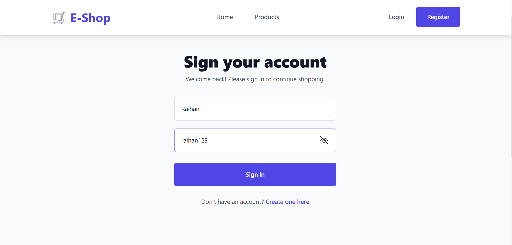
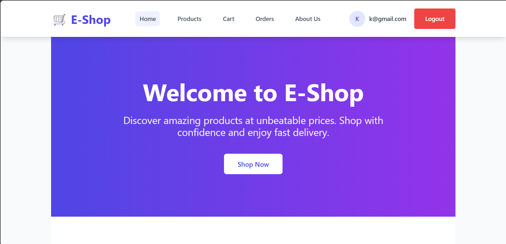
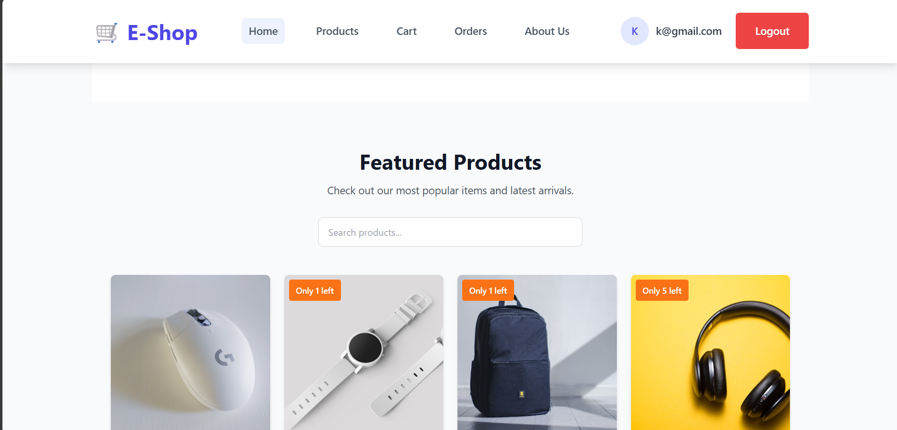
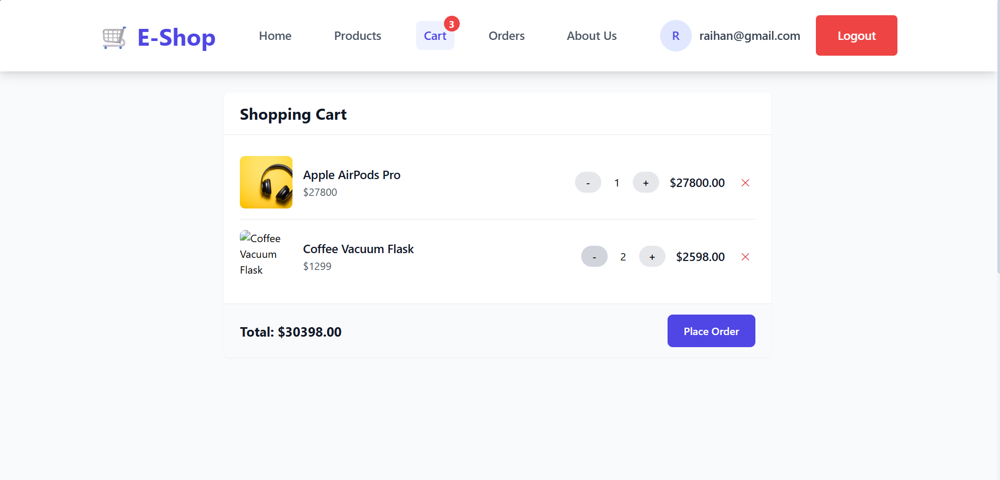
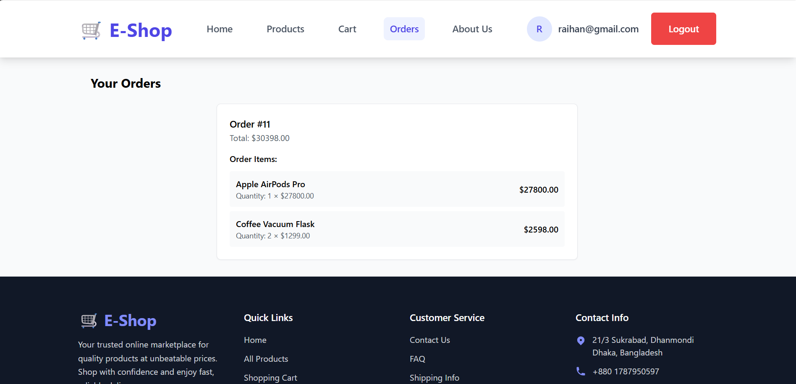
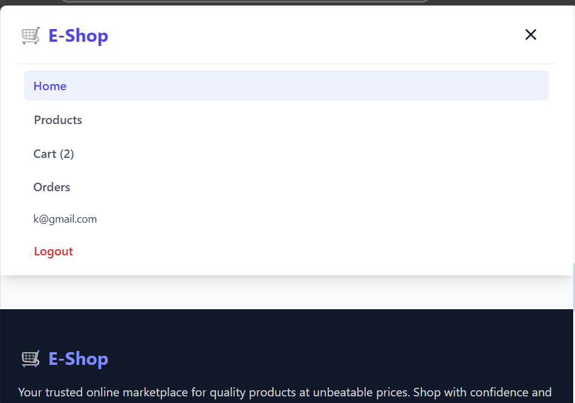
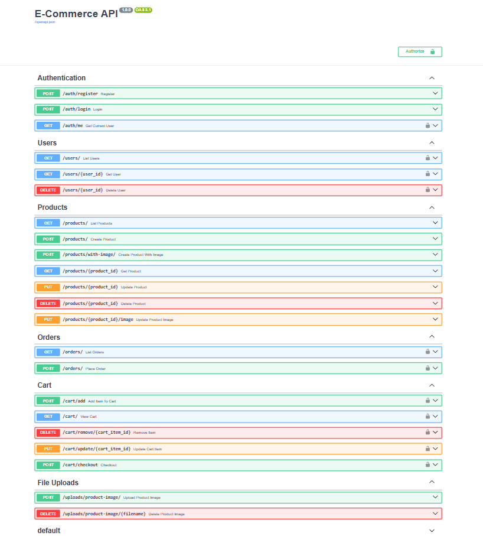

# 🛒 E-Shop - Complete E-Commerce Platform

A full-stack e-commerce platform built with **FastAPI** (backend) and **React** (frontend), featuring modern UI/UX, secure authentication, cart management, order processing, and admin capabilities.

🚀 **Live API Docs**: [https://web-production-c09a8.up.railway.app/docs](https://web-production-c09a8.up.railway.app/docs)

---

## 🎯 Project Overview

E-Shop is a comprehensive e-commerce solution that provides both customer-facing features and backend API capabilities. The platform offers a seamless shopping experience with modern design, responsive interface, and robust functionality.

---

## ✨ Key Features

### 🎨 Frontend Features
- 🎯 **Modern UI/UX** - Beautiful, responsive design with Tailwind CSS
- 🔐 **User Authentication** - Secure login/register system with JWT
- 🛒 **Shopping Cart** - Add, update, remove items with real-time updates
- 📦 **Product Catalog** - Browse products with search and filtering
- 🛍️ **Order Management** - Place orders and view order history
- 📱 **Responsive Design** - Works perfectly on desktop, tablet, and mobile
- 🖼️ **Image Upload** - Product image management with file upload
- 📄 **Smooth Navigation** - Single-page application with React Router
- 🎨 **Interactive Elements** - Hover effects, loading states, animations

### ⚙️ Backend Features
- 🔐 **JWT Authentication** - Secure token-based authentication
- 👤 **User Management** - Registration, login, profile management
- 📦 **Product CRUD** - Complete product management with image support
- 🛒 **Cart System** - Add, update, remove cart items with quantity management
- 🧾 **Order Processing** - Complete order workflow from cart to completion
- 📊 **Database Management** - SQLAlchemy ORM with SQLite
- 📁 **File Upload** - Image upload and static file serving
- 🔒 **Security** - Password hashing, CORS handling, input validation
- 📖 **API Documentation** - Auto-generated Swagger UI and ReDoc

---

## 📸 Screenshots
Here is the quick peack at E-Shop!

### 👤 Authentication

*Clean login and registration interface with form validation*

### 🏠 Homepage

*Modern landing page with hero section, featured products, and smooth navigation*

### 📦 Product Listing

*Grid layout of products with search functionality and responsive design*

### 🛒 Shopping Cart

*Interactive cart with quantity controls, item management, and checkout*


### 📋 Order History

*User order tracking with detailed order information and status*

### 📱 Mobile Responsive

*Fully responsive design that works perfectly on mobile devices*

### 📊 API Documentation


*Interactive Swagger UI for testing and exploring API endpoints*

---

## 🛠 Tech Stack

### Frontend
- ⚛️ **React 18** - Modern React with hooks
- 🎨 **Tailwind CSS** - Utility-first CSS framework
- 🧭 **React Router** - Client-side routing
- 🌐 **Axios** - HTTP client for API calls
- ⚡ **Vite** - Fast build tool and dev server
- 🎯 **Context API** - State management for auth and cart

### Backend
- ⚡ **FastAPI** - Modern Python web framework
- 🗄️ **SQLAlchemy** - Python SQL toolkit and ORM
- 💾 **SQLite** - Lightweight database (production-ready)
- 🔐 **JWT** - JSON Web Tokens for authentication
- 📝 **Pydantic** - Data validation using Python type annotations
- 📁 **Python Multipart** - File upload support
- 🔒 **Passlib** - Password hashing utilities

---

## 📦 Project Structure

```
ecommerce-api/
├── 📁 app/                          # Backend FastAPI application
│   ├── 📄 main.py                   # FastAPI app entry point
│   ├── 📄 models.py                 # SQLAlchemy database models
│   ├── 📄 schemas.py                # Pydantic data schemas
│   ├── 📄 crud.py                   # Database operations
│   ├── 📄 auth.py                   # Authentication utilities
│   ├── 📄 database.py               # Database configuration
│   └── 📁 routes/                   # API route handlers
│       ├── 📄 auth.py               # Authentication routes
│       ├── 📄 users.py              # User management routes
│       ├── 📄 products.py           # Product CRUD routes
│       ├── 📄 cart.py               # Shopping cart routes
│       ├── 📄 orders.py             # Order management routes
│       └── 📄 uploads.py            # File upload routes
├── 📁 ecommerce-frontend/           # Frontend React application
│   ├── 📁 src/
│   │   ├── 📄 App.jsx               # Main app component
│   │   ├── 📄 main.jsx              # React entry point
│   │   ├── 📁 components/           # Reusable components
│   │   │   ├── 📄 Header.jsx        # Navigation header
│   │   │   ├── 📄 Footer.jsx        # Site footer
│   │   │   ├── 📄 ProductCard.jsx   # Product display card
│   │   │   └── 📄 About.jsx         # About page component
│   │   ├── 📁 pages/                # Page components
│   │   │   ├── 📄 Home.jsx          # Homepage with featured products
│   │   │   ├── 📄 Products.jsx      # Product listing page
│   │   │   ├── 📄 Product.jsx       # Single product page
│   │   │   ├── 📄 Cart.jsx          # Shopping cart page
│   │   │   ├── 📄 Orders.jsx        # Order history page
│   │   │   ├── 📄 Login.jsx         # Login page
│   │   │   └── 📄 Register.jsx      # Registration page
│   │   ├── 📁 contexts/             # React context providers
│   │   │   ├── 📄 AuthContext.jsx   # Authentication context
│   │   │   └── 📄 CartContext.jsx   # Shopping cart context
│   │   └── 📄 api.js                # API client configuration
│   ├── 📄 package.json              # Frontend dependencies
│   └── 📄 tailwind.config.js        # Tailwind CSS configuration
├── 📁 uploads/                      # User uploaded images
├── 📄 requirements.txt              # Python dependencies
├── 📄 ecommerce.db                  # SQLite database
└── 📄 README.md                     # Project documentation
```

---

## 🚀 Quick Start

### Prerequisites
- Python 3.9+
- Node.js 16+
- npm or yarn

### 1️⃣ Clone the Repository
```bash
git clone https://github.com/kabirhiking/ecommerce-api.git
cd ecommerce-api
```

### 2️⃣ Backend Setup
```bash
# Create and activate virtual environment
python -m venv env
env\Scripts\activate          # Windows
source env/bin/activate       # macOS/Linux

# Install Python dependencies
pip install -r requirements.txt

# Start the FastAPI server
uvicorn app.main:app --reload
```

The backend API will be available at: http://127.0.0.1:8000

### 3️⃣ Frontend Setup
```bash
# Navigate to frontend directory
cd ecommerce-frontend

# Install Node.js dependencies
npm install

# Start the React development server
npm run dev
```

The frontend will be available at: http://localhost:5173

### 4️⃣ Access the Application
- **Frontend**: http://localhost:5173
- **Backend API**: http://127.0.0.1:8000
- **API Documentation**: http://127.0.0.1:8000/docs
- **ReDoc**: http://127.0.0.1:8000/redoc

---

## 📚 API Documentation

### 🔐 Authentication Endpoints
| Method | Endpoint | Description | Body |
|--------|----------|-------------|------|
| POST | `/auth/register` | Register new user | `{username, email, password}` |
| POST | `/auth/login` | Login user | `{username, password}` |

### 👤 User Endpoints
| Method | Endpoint | Description | Auth Required |
|--------|----------|-------------|---------------|
| GET | `/users/me` | Get current user profile | ✅ |
| GET | `/users/` | Get all users (admin) | ✅ |

### 📦 Product Endpoints
| Method | Endpoint | Description | Auth Required |
|--------|----------|-------------|---------------|
| GET | `/products/` | Get all products | ❌ |
| GET | `/products/{id}` | Get single product | ❌ |
| POST | `/products/` | Create product | ✅ |
| PUT | `/products/{id}` | Update product | ✅ |
| DELETE | `/products/{id}` | Delete product | ✅ |

### 🛒 Cart Endpoints
| Method | Endpoint | Description | Auth Required |
|--------|----------|-------------|---------------|
| GET | `/cart/` | Get user's cart | ✅ |
| POST | `/cart/add` | Add item to cart | ✅ |
| PUT | `/cart/update/{item_id}` | Update cart item quantity | ✅ |
| DELETE | `/cart/remove/{item_id}` | Remove item from cart | ✅ |
| POST | `/cart/checkout` | Checkout cart to create order | ✅ |

### 🧾 Order Endpoints
| Method | Endpoint | Description | Auth Required |
|--------|----------|-------------|---------------|
| GET | `/orders/` | Get user's orders | ✅ |
| GET | `/orders/{id}` | Get order details | ✅ |
| POST | `/orders/` | Create new order | ✅ |

### 📁 Upload Endpoints
| Method | Endpoint | Description | Auth Required |
|--------|----------|-------------|---------------|
| POST | `/uploads/product-image` | Upload product image | ✅ |

---

## 🔧 Configuration

### Environment Variables
Create a `.env` file in the root directory:
```env
DATABASE_URL=sqlite:///./ecommerce.db
SECRET_KEY=your_super_secret_key_here
ALGORITHM=HS256
ACCESS_TOKEN_EXPIRE_MINUTES=30
```

### Frontend Configuration
Update the API base URL in `ecommerce-frontend/src/api.js`:
```javascript
const API_BASE_URL = 'http://127.0.0.1:8000'
```

---

## 🎨 UI/UX Features

- **Responsive Design**: Optimized for all screen sizes
- **Modern Aesthetics**: Clean, professional design with Tailwind CSS
- **Interactive Elements**: Hover effects, loading states, smooth transitions
- **User-Friendly Navigation**: Intuitive menu and routing
- **Shopping Experience**: Seamless add to cart, quantity updates, checkout flow
- **Visual Feedback**: Success/error messages, loading indicators
- **Image Management**: Product image uploads with preview

---

## 🔒 Security Features

- **JWT Authentication**: Secure token-based authentication
- **Password Hashing**: Bcrypt password hashing
- **CORS Configuration**: Proper cross-origin resource sharing setup
- **Input Validation**: Pydantic schema validation
- **File Upload Security**: Secure file handling and validation
- **SQL Injection Protection**: SQLAlchemy ORM protection

---

## 🚀 Deployment

### Backend Deployment (Railway/Heroku)
1. Create `Procfile`:
   ```
   web: uvicorn app.main:app --host 0.0.0.0 --port $PORT
   ```
2. Deploy to your preferred platform

### Frontend Deployment (Vercel/Netlify)
1. Build the production version:
   ```bash
   npm run build
   ```
2. Deploy the `dist` folder

---

## 🧪 Testing

### Backend Testing
```bash
# Run tests (if you have tests set up)
pytest

# Test API endpoints manually
curl -X GET "http://127.0.0.1:8000/products/"
```

### Frontend Testing
```bash
# Run frontend tests
npm test
```

---

## 📝 Usage Examples

### Register a New User
```bash
curl -X POST "http://127.0.0.1:8000/auth/register" \
     -H "Content-Type: application/json" \
     -d '{"username":"john_doe","email":"john@example.com","password":"secret123"}'
```

### Add Product to Cart
```bash
curl -X POST "http://127.0.0.1:8000/cart/add" \
     -H "Authorization: Bearer YOUR_TOKEN" \
     -H "Content-Type: application/json" \
     -d '{"product_id":1,"quantity":2}'
```

---

## 🤝 Contributing

1. Fork the repository
2. Create a feature branch (`git checkout -b feature/amazing-feature`)
3. Commit your changes (`git commit -m 'Add some amazing feature'`)
4. Push to the branch (`git push origin feature/amazing-feature`)
5. Open a Pull Request

---

## 📄 License

This project is licensed under the MIT License - see the LICENSE file for details.

---

## 📞 Support & Contact

**Made with ❤️ by Raihan Kabir**

- 📧 **Email**: kabirraihan249@gmail.com
- 🐙 **GitHub**: [@kabirhiking](https://github.com/kabirhiking)


---

*⭐ If you found this project helpful, please give it a star on GitHub!*
